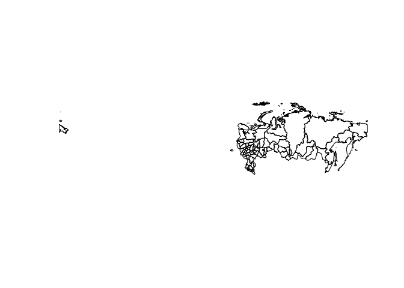

Создание простых матриц пространственных весов для российских регионов
================

В этом примере я показываю, как можно быстро создать матрицы
пространственных весов для российских регионов. Такие матрицы могут
понадобиться для анализа пространственной корреляции или применения
методов пространственной эконометрики.

## Загрузка пакетов

Для начала установим и загрузим пакеты, необходимые для
пространственного анализа.

``` r
library(tidyverse)    # манипуляции с данными и визуализация
```

    ## ── Attaching core tidyverse packages ──────────────────────── tidyverse 2.0.0 ──
    ## ✔ dplyr     1.1.4     ✔ readr     2.1.4
    ## ✔ forcats   1.0.0     ✔ stringr   1.5.1
    ## ✔ ggplot2   3.4.4     ✔ tibble    3.2.1
    ## ✔ lubridate 1.9.3     ✔ tidyr     1.3.0
    ## ✔ purrr     1.0.2     
    ## ── Conflicts ────────────────────────────────────────── tidyverse_conflicts() ──
    ## ✖ dplyr::filter() masks stats::filter()
    ## ✖ dplyr::lag()    masks stats::lag()
    ## ℹ Use the conflicted package (<http://conflicted.r-lib.org/>) to force all conflicts to become errors

``` r
library(geodata)      # для доступа к данным о границах
```

    ## Загрузка требуемого пакета: terra
    ## terra 1.7.71
    ## 
    ## Присоединяю пакет: 'terra'
    ## 
    ## Следующий объект скрыт от 'package:tidyr':
    ## 
    ##     extract

``` r
library(sp)           # манипуляции с пространственными объектами
library(spdep)        # манипуляции с пространственными объектами
```

    ## Загрузка требуемого пакета: spData
    ## To access larger datasets in this package, install the spDataLarge
    ## package with: `install.packages('spDataLarge',
    ## repos='https://nowosad.github.io/drat/', type='source')`
    ## Загрузка требуемого пакета: sf
    ## Linking to GEOS 3.10.2, GDAL 3.4.1, PROJ 8.2.1; sf_use_s2() is TRUE

``` r
library(sf)           # манипуляции с пространственными объектами

sf_use_s2(FALSE)      # исправляет некоторые ошибки https://gis.stackexchange.com/questions/404385/r-sf-some-edges-are-crossing-in-a-multipolygon-how-to-make-it-valid-when-using
```

    ## Spherical geometry (s2) switched off

## Пространственные данные

Для осуществления пространственного анализа нам для начала нужны
геоданные. Я буду использовать функцию из пакета `geodata` для доступа к
данным с сайта GADM: <https://gadm.org/data.html> версии 3.6. На самом
сайте есть более новые версии в разных форматах, но я привык к этой.
Подробнее о форматах: <https://gadm.org/formats.html>.

Загрузим геоданные о российских регионах (для уровня регионов указываем
`level = 1`):

``` r
rus_reg_gpkg <- geodata::gadm(country = 'RUS', level = 1, path = tempdir(), version = 3.6)
glimpse(rus_reg_gpkg)
```

    ## S4 class 'SpatVector' [package "terra"]

Перейдем к другому формату, чтобы можно было использовать возможности
пакета `sf`:

``` r
rus_reg_sf <- sf::st_as_sf(rus_reg_gpkg)
glimpse(rus_reg_sf)
```

    ## Rows: 83
    ## Columns: 11
    ## $ GID_0     <chr> "RUS", "RUS", "RUS", "RUS", "RUS", "RUS", "RUS", "RUS", "RUS…
    ## $ NAME_0    <chr> "Russia", "Russia", "Russia", "Russia", "Russia", "Russia", …
    ## $ GID_1     <chr> "RUS.1_1", "RUS.2_1", "RUS.3_1", "RUS.4_1", "RUS.5_1", "RUS.…
    ## $ NAME_1    <chr> "Adygey", "Altay", "Amur", "Arkhangel'sk", "Astrakhan'", "Ba…
    ## $ VARNAME_1 <chr> "Adygea|Adygeya|Adygheya|Republic of Adygeya|Adygeyskaya A.O…
    ## $ NL_NAME_1 <chr> "Республика Адыгея", "Алтайский край", "Амурская область", "…
    ## $ TYPE_1    <chr> "Respublika", "Kray", "Oblast", "Oblast", "Oblast", "Respubl…
    ## $ ENGTYPE_1 <chr> "Republic", "Territory", "Region", "Region", "Region", "Repu…
    ## $ CC_1      <chr> NA, NA, NA, NA, NA, NA, NA, NA, NA, NA, NA, "7001", NA, "601…
    ## $ HASC_1    <chr> "RU.AD", "RU.AL", "RU.AM", "RU.AR", "RU.AS", "RU.BK", "RU.BL…
    ## $ geometry  <GEOMETRY [°]> POLYGON ((39.65986 43.9976,..., POLYGON ((82.80364 …

Теперь мы работаем с набором данных, в котором содержатся различные
пространственные данные. Колонки `NAME_1`, `NL_NAME_1` содержат названия
регионов на латинице и на русском соответственно. И те, и другие не
совсем соответствуют официальным названиям регионов РФ, но что-то нам
нужно будет использовать для объединения с экономическими данными по
регионам. Я для этого возьму колонку `NAME_1` для воспроизводимости в
международном контексте и лучшей читаемости иностранными коллегами.

Колонка `geometry` содержит координаты для построения мультиполигонов.
Эти данные позволяют строить карты.

Из-за расположения территории России в двух полушариях карта выглядит не
очень корректно:

``` r
plot(st_geometry(rus_reg_sf))
```

<!-- -->

Исправим проблему с координатной системой:

``` r
rus_reg_sf <- sf::st_transform(rus_reg_sf, crs = "+proj=longlat +lon_wrap=180")
```

Теперь получается адекватная карта:

``` r
 plot(st_geometry(rus_reg_sf))
```

<!-- -->

## Создание матриц пространственных весов

Для создания матриц нам нужно преобразовать данные в ещё один формат
(“Large SpatialPolygonDataFrame”):

``` r
rus_reg_poly <- sf::as_Spatial(rus_reg_sf)
str(rus_reg_poly, max.level = 2)
```

    ## Formal class 'SpatialPolygonsDataFrame' [package "sp"] with 5 slots
    ##   ..@ data       :'data.frame':  83 obs. of  10 variables:
    ##   ..@ polygons   :List of 83
    ##   ..@ plotOrder  : int [1:83] 60 35 12 80 18 28 30 4 40 32 ...
    ##   ..@ bbox       : num [1:2, 1:2] 19.6 41.2 190.3 81.9
    ##   .. ..- attr(*, "dimnames")=List of 2
    ##   ..@ proj4string:Formal class 'CRS' [package "sp"] with 1 slot
    ##   ..$ comment: chr "TRUE"

### Матрица весов, основанная на обратных расстояниях

Для начала создадим матрицу обратных расстояний между географическими
центроидами регионов. Бывают и более продвинутые матрицы расстояний, в
частности, основанные на расстояниях по дорогам между столицами
регионов, но для их создания нужны дополнительные данные. А матрицу
расстояний между центроидами можно создать автоматически из загруженных
геоданных.

Сначала создадим матрицу расстояний:

``` r
coords <- sp::coordinates(rus_reg_poly)
dist_mat <- sp::spDists(coords, longlat = TRUE) #   find Euclidean distance between points
```

Теперь на её основе создадим матрицу обратных расстояний. По главной
диагонали этой матрицы должны стоять нули, а вне диагонали — обратные
расстояния.

``` r
inv_dist_mat <- 1 / dist_mat
diag(inv_dist_mat) <- 0
```

Матрица обратных расстояний готова, однако напрямую в анализе редко
используют. Поэтому проведем ещё пару преобразований:

``` r
inv_dist_lw <- spdep::mat2listw(inv_dist_mat, row.names = rus_reg_poly$NAME_1, style = "W")
inv_dist_w_mat <- spdep::listw2mat(inv_dist_lw)
```

`inv_dist_lw` — это список, содержащий в себе различные геоданные: он
может понадобиться при работе с пространственными пакетами.
`inv_dist_w_mat` — матрица весов, основанная на обратных расстояниях. В
отличие от исходной матрицы `inv_dist_mat`, она является нормализованной
по строкам, т. е. сумма каждой строки равна единице, что обычно принято
в пространственном анализе.

``` r
sum(inv_dist_w_mat[1, ])
```

    ## [1] 1

``` r
sum(inv_dist_w_mat)
```

    ## [1] 83

### Матрица весов, основанная на соседстве

Теперь построим матрицу весов, основанную на соседстве, т. е. наличии
общих границ. Сначала создадим список с информацией о списке соседей
каждого региона. Это может занять некоторое время.

``` r
rus_reg_nb <- spdep::poly2nb(rus_reg_poly)
```

    ## although coordinates are longitude/latitude, st_intersects assumes that they
    ## are planar

С использованием этого объекта можно создавать матрицы весов. Но у него
есть одна проблема: у Калиниградской и Сахалинской областей нет общих
границ с другими российскими регионами.

``` r
summary(rus_reg_nb)
```

    ## Neighbour list object:
    ## Number of regions: 83 
    ## Number of nonzero links: 376 
    ## Percentage nonzero weights: 5.457976 
    ## Average number of links: 4.53012 
    ## 2 regions with no links:
    ## 21 61
    ## 3 disjoint connected subgraphs
    ## Link number distribution:
    ## 
    ##  0  1  2  3  4  5  6  7  8  9 
    ##  2  5  5  9 19 22  8  5  7  1 
    ## 5 least connected regions:
    ## 1 14 43 45 56 with 1 link
    ## 1 most connected region:
    ## 31 with 9 links

``` r
rus_reg_nb[[21]]
```

    ## [1] 0

``` r
rus_reg_nb[[61]]
```

    ## [1] 0

``` r
rus_reg_sf[c(21, 61), "NAME_1"]
```

    ## Simple feature collection with 2 features and 1 field
    ## Geometry type: MULTIPOLYGON
    ## Dimension:     XY
    ## Bounding box:  xmin: 19.6425 ymin: 43.36017 xmax: 156.5145 ymax: 55.29071
    ## Geodetic CRS:  +proj=longlat +lon_wrap=180
    ##         NAME_1                       geometry
    ## 21 Kaliningrad MULTIPOLYGON (((19.73749 54...
    ## 61    Sakhalin MULTIPOLYGON (((146.0165 43...

Для исправления этой проблемы я использую функцию, найденную
[здесь](https://stackoverflow.com/questions/57269254/how-to-impute-missing-neighbours-of-a-spatial-weight-matrix-queen-contiguity).
Для регионов без соседей функция назначает соседом ближайшего по
расстояниям между центроидами.

``` r
addnbs <- function(sp.sample){
  
  queen_nb <- poly2nb(sp.sample, row.names = sp.sample$ID, queen = TRUE)
  
  count = card(queen_nb)
  if (!any(count == 0)) {
    return(queen_nb)
  }
  
  ## get nearest neighbour index, use centroids:
  nnbs = knearneigh(coordinates(sp.sample))$nn
  
  no_edges_from = which(count == 0)
  for (i in no_edges_from) {
    queen_nb[[i]] = nnbs[i]
  }
  return(queen_nb)
}
```

``` r
rus_reg_nb_fix <- addnbs(rus_reg_poly)
```

    ## although coordinates are longitude/latitude, st_intersects assumes that they
    ## are planar

Теперь у всех есть соседи:

``` r
summary(rus_reg_nb_fix)
```

    ## Neighbour list object:
    ## Number of regions: 83 
    ## Number of nonzero links: 378 
    ## Percentage nonzero weights: 5.487008 
    ## Average number of links: 4.554217 
    ## Link number distribution:
    ## 
    ##  1  2  3  4  5  6  7  8  9 
    ##  7  5  9 19 22  8  5  7  1 
    ## 7 least connected regions:
    ## 1 14 21 43 45 56 61 with 1 link
    ## 1 most connected region:
    ## 31 with 9 links

Как видим, соседом для Калининградской области “назначена” Псковская
область, а для Сахалинской области — Хабаровский край, что выглядит
разумно.

``` r
rus_reg_nb_fix[[21]]
```

    ## [1] 57

``` r
rus_reg_nb_fix[[61]]
```

    ## [1] 28

``` r
rus_reg_sf[c(57, 28), "NAME_1"]
```

    ## Simple feature collection with 2 features and 1 field
    ## Geometry type: GEOMETRY
    ## Dimension:     XY
    ## Bounding box:  xmin: 27.31753 ymin: 45.03583 xmax: 147.2791 ymax: 62.49355
    ## Geodetic CRS:  +proj=longlat +lon_wrap=180
    ##        NAME_1                       geometry
    ## 57      Pskov POLYGON ((31.03134 55.71665...
    ## 28 Khabarovsk MULTIPOLYGON (((136.6436 45...

Теперь можем создать список с весами и нормализованную по строкам
матрицу весов.

``` r
contig_lw <- spdep::nb2listw(rus_reg_nb_fix,  zero.policy = T) 
contig_w_mat <- spdep::listw2mat(contig_lw)
```

``` r
sum(contig_w_mat[1, ])
```

    ## [1] 1

``` r
sum(contig_w_mat)
```

    ## [1] 83
